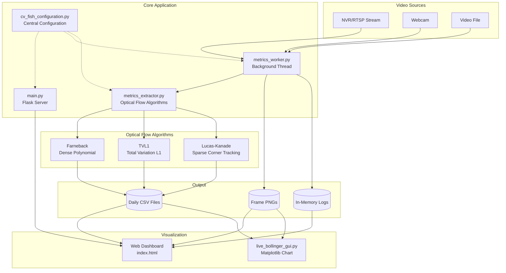
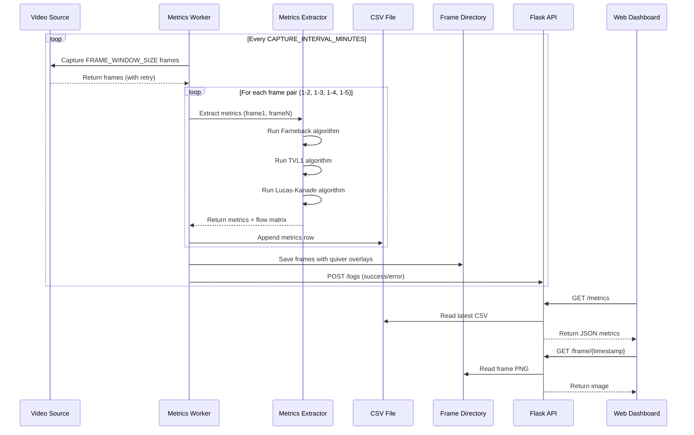
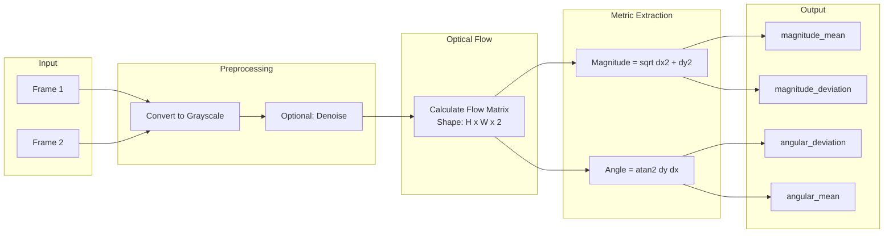
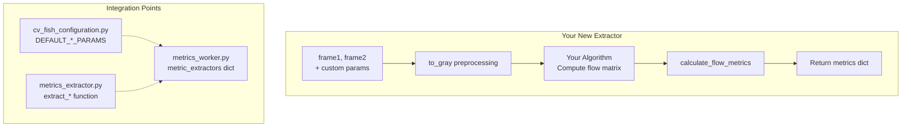
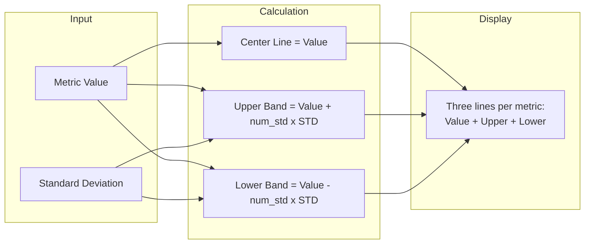
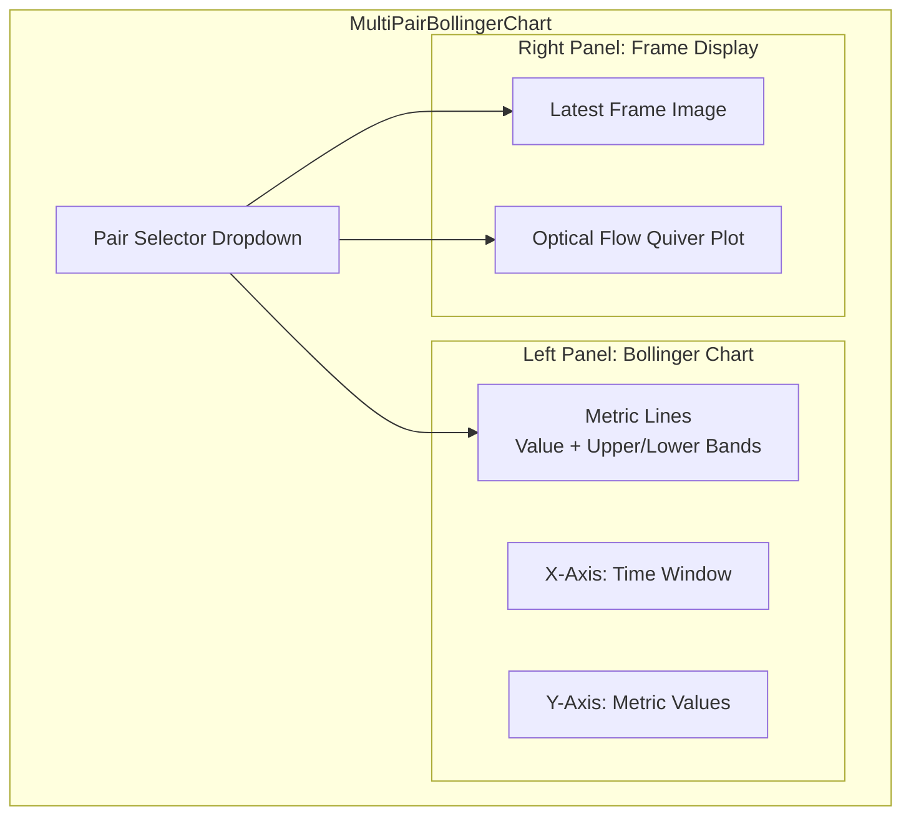

# CV-Fish

A computer vision application for **optical flow analysis and real-time motion metric extraction** from video streams. Designed for analyzing motion characteristics in sensor input (particularly aquatic/fish monitoring), the system computes multiple optical flow algorithms and provides both a REST API and web dashboard for monitoring metrics.

> The first few commits are imported work from colleague Shai Kendler and credit for that belongs with him.

---

## Table of Contents

- [Features](#features)
- [Project Architecture](#project-architecture)
- [Data Flow](#data-flow)
- [Installation](#installation)
- [Quick Start](#quick-start)
- [Configuration](#configuration)
- [API Reference](#api-reference)
- [Adding New Metrics Extractors](#adding-new-metrics-extractors)
- [Updating the Live Bollinger Graph](#updating-the-live-bollinger-graph)
- [Project Structure](#project-structure)
- [Contributing](#contributing)

---

## Features

- **Multiple Optical Flow Algorithms**: Farneback, TVL1, and Lucas-Kanade
- **Real-time Metrics**: Magnitude mean, magnitude deviation, angular deviation, angular mean
- **Web Dashboard**: Bootstrap-based UI with Chart.js visualizations
- **REST API**: JSON endpoints for metrics, frames, and logs
- **Live Bollinger Charts**: Statistical bands for trend analysis
- **Configurable Video Sources**: NVR/RTSP, webcam, or video file
- **Automatic Frame Capture**: Background worker with retry logic

---

## Project Architecture



---

## Data Flow



---

## Metrics Calculation Flow



---

## Installation

### Prerequisites

- Python 3.9+
- Conda or Mamba (recommended)
- OpenCV with contrib modules

### Setup

```bash
# Clone the repository
git clone https://github.com/your-username/CV-Fish.git
cd CV-Fish

# Create conda environment
mamba env create -f environment.yml
# or: conda env create -f environment.yml

# Activate environment
conda activate cv-fish
```

### Dependencies

| Category | Packages |
|----------|----------|
| **Numerics** | numpy, scipy, pandas, scikit-learn |
| **Computer Vision** | opencv, pillow |
| **Visualization** | matplotlib, tqdm |
| **Web Framework** | flask, requests |
| **Utilities** | frozendict, blobfile, spectral |

---

## Quick Start

### Option 1: Web Dashboard (Recommended)

```bash
python main.py
```

Open http://localhost:5000 in your browser.

### Option 2: Standalone CLI with Matplotlib GUI

```bash
python matplotlib_main.py
```

### Option 3: Jupyter Notebook (Experimental)

```bash
jupyter notebook process_video_experiment.ipynb
```

---

## Configuration

All configuration is centralized in `cv_fish_configuration.py`.

### Video Source

```python
# Edit cv_fish_configuration.py

# For NVR/RTSP:
NVR_IP = os.getenv('NVR_IP', '192.168.1.56')  # Override with env var
NVR_USER = 'admin'
NVR_PASS = 'admin12345'

# For local video file:
VIDEO_FILE_PATH = './Workable Data/Processed/DPH21_Above_IR10.avi'

# For webcam:
# Use VIDEO_SOURCE['WEBCAM'] = 0
```

Then in `metrics_worker.py`, set the source:
```python
is_webcam = False
is_nvr = True  # or False for file
```

### Sampling Parameters

| Parameter | Default | Description |
|-----------|---------|-------------|
| `FRAME_WINDOW_SIZE` | 5 | Frames captured per session |
| `CAPTURE_INTERVAL_MINUTES` | 10 | Minutes between captures |
| `CAPTURE_RETRY_ATTEMPTS` | 3 | Retries on frame capture failure |
| `DEFAULT_SUPER_PIXEL_SHAPE` | (4, 4) | Downscale factor for processing |

### Bollinger Chart Settings

| Parameter | Default | Description |
|-----------|---------|-------------|
| `T_WINDOW` | 100 | Rolling window in seconds |
| `BOLLINGER_NUM_STD_OF_BANDS` | 2.0 | Standard deviations for bands |

---

## API Reference

| Endpoint | Method | Description |
|----------|--------|-------------|
| `/` | GET | Web dashboard |
| `/metrics` | GET | Latest CSV metrics as JSON |
| `/frame` | GET | Most recent frame |
| `/frame/{timestamp}` | GET | Frame by timestamp |
| `/frames` | GET | List all frame timestamps |
| `/frames/{timestamp}` | GET | List frames for timestamp |
| `/frames/{timestamp}/{index}` | GET | Specific frame by index |
| `/logs` | GET | Worker log entries |
| `/logs` | POST | Submit log entry (worker use) |

### Example Response: `/metrics`

```json
{
  "timestamp": "20250102-143022",
  "metrics": [
    {
      "pair": "1-2",
      "metric_name": "Farneback",
      "time": "20250102-143022",
      "magnitude_mean": "2.34",
      "magnitude_deviation": "1.12",
      "angular_deviation": "0.89",
      "angular_mean": "3.14"
    }
  ]
}
```

---

## Adding New Metrics Extractors

This section explains how to add a custom optical flow algorithm or metric extractor.

### Step 1: Create the Extractor Function

Add your function to `metrics_extractor.py`:

```python
def extract_my_custom_metric(
    frame1: np.ndarray,
    frame2: np.ndarray,
    my_param: float = 1.0,
    should_apply_gaussian_denoiser: bool = False
) -> dict:
    """
    Extract metrics using your custom algorithm.

    Parameters:
        frame1: First BGR frame
        frame2: Second BGR frame
        my_param: Your custom parameter
        should_apply_gaussian_denoiser: Apply denoising preprocessing

    Returns:
        dict with keys: magnitude_mean, magnitude_deviation,
                       angular_deviation, angular_mean
              Optional: flow_matrix (H, W, 2) for visualization
    """
    # Convert to grayscale
    gray1, gray2 = to_gray(frame1, frame2, should_apply_gaussian_denoiser)

    # === YOUR OPTICAL FLOW ALGORITHM HERE ===
    # Example: compute flow matrix of shape (H, W, 2)
    # flow[y, x] = [dx, dy] displacement vector
    flow = np.zeros((gray1.shape[0], gray1.shape[1], 2), dtype=np.float32)

    # ... your algorithm logic ...

    # Calculate standard metrics from flow
    metrics = calculate_flow_metrics(flow)

    # Optionally include flow matrix for quiver visualization
    metrics["flow_matrix"] = flow

    return metrics
```

### Step 2: Add Configuration Parameters

Add default parameters to `cv_fish_configuration.py`:

```python
DEFAULT_MY_CUSTOM_PARAMS = frozendict({
    "my_param": 1.0,
    "should_apply_gaussian_denoiser": False
})
```

### Step 3: Register the Extractor

Update the `metric_extractors` dictionary in `metrics_worker.py`:

```python
from metrics_extractor import (
    extract_farneback_metric,
    extract_TVL1_metric,
    extract_lucas_kanade_metric,
    extract_my_custom_metric,  # Add import
    extract_metrics,
    append_metrics,
)

# In _metrics_loop():
metric_extractors = {
    'Lucas-Kanade': {
        'kwargs': conf.DEFAULT_LUCAS_KANADE_PARAMS,
        'function': extract_lucas_kanade_metric
    },
    'Farneback': {
        'kwargs': conf.DEFAULT_FARNEBACK_PARAMS,
        'function': extract_farneback_metric
    },
    'TVL1': {
        'kwargs': conf.DEFAULT_TVL1_PARAMS,
        'function': extract_TVL1_metric
    },
    # Add your new extractor:
    'MyCustom': {
        'kwargs': conf.DEFAULT_MY_CUSTOM_PARAMS,
        'function': extract_my_custom_metric
    },
}
```

### Extractor Architecture



### Output Format

Your extractor must return a dictionary with these keys:

```python
{
    "magnitude_mean": float,      # Average motion speed
    "magnitude_deviation": float, # Motion variability (std)
    "angular_deviation": float,   # Direction consistency (std)
    "angular_mean": float,        # Overall motion direction
    "flow_matrix": np.ndarray     # Optional: (H, W, 2) for visualization
}
```

---

## Updating the Live Bollinger Graph

The `MultiPairBollingerChart` class in `live_bollinger_gui.py` provides real-time visualization with Bollinger bands.

### Basic Usage

```python
from live_bollinger_gui import MultiPairBollingerChart
import numpy as np

# Initialize chart with frame pair labels
chart = MultiPairBollingerChart(
    pair_labels=["1-2", "1-3", "1-4", "1-5"],
    t_window=100.0,  # Rolling window in seconds
    num_std=2.0      # Bollinger band width
)

# Push new data
chart.push_new_data(
    data_dict={
        "Farneback_magnitude_mean": (value, std_dev),
        "TVL1_magnitude_mean": (value, std_dev),
    },
    frame=frame_array,      # Optional: numpy array (H, W, 3)
    flow=flow_matrix,       # Optional: numpy array (H, W, 2)
    pair_name="1-2"
)
```

### Bollinger Band Calculation



### Customizing the Chart

#### Adding New Metrics to Display

When you push data, new lines are automatically created:

```python
# Each key in data_dict becomes a separate line group
chart.push_new_data(
    data_dict={
        "MyCustom_magnitude_mean": (2.5, 0.3),
        "MyCustom_angular_deviation": (1.2, 0.1),
    },
    pair_name="1-2"
)
```

#### Modifying Quiver Plot Appearance

Edit `QUIVER_KWARGS` in `cv_fish_configuration.py`:

```python
QUIVER_KWARGS = frozendict({
    "color": 'red',           # Arrow color
    "scale": 0.05,            # Arrow size (smaller = longer)
    "pivot": 'tail',          # Arrow anchor point
    "width": 0.005,           # Arrow thickness
    "headwidth": 10,          # Arrowhead width
    "headlength": 12,         # Arrowhead length
    "alpha": 1.0,             # Transparency
})
```

#### Adjusting Time Window

```python
# In cv_fish_configuration.py
T_WINDOW: Final[int] = 100  # seconds of history to display

# Or when creating the chart
chart = MultiPairBollingerChart(
    pair_labels=["1-2"],
    t_window=60.0,  # Show last 60 seconds
    num_std=1.5     # Tighter bands
)
```

### Chart Components



### Key Methods

| Method | Description |
|--------|-------------|
| `push_new_data(data_dict, frame, flow, pair_name)` | Add new sample and update display |
| `wait_with_ui(seconds)` | Sleep while keeping UI responsive |
| `_on_pair_change(label)` | Callback when dropdown selection changes |
| `_update_bollinger_plot()` | Redraw lines with current data window |
| `_update_image(frame)` | Update the frame display panel |
| `_update_flow_quiver(flow, step)` | Overlay flow vectors on frame |

---

## Project Structure

```
CV-Fish/
├── main.py                    # Flask REST API server
├── metrics_worker.py          # Background metrics extraction thread
├── metrics_extractor.py       # Optical flow algorithms & metrics
├── live_bollinger_gui.py      # Matplotlib interactive charting
├── matplotlib_main.py         # Standalone CLI with GUI
├── cv_fish_configuration.py   # Central configuration
├── timer.py                   # Microsecond precision timer
├── dense_flow_to_torch.py     # Convert flow to PyTorch tensors
├── check_enironment_for_cuda.py # CUDA/cuDNN detection
│
├── templates/
│   └── index.html             # Bootstrap web dashboard
│
├── output/                    # Generated outputs
│   ├── YYYYMMDD.csv          # Daily metrics files
│   ├── latest_frame.png      # Most recent frame
│   ├── latest_frame_timestamp.txt
│   └── frames/               # All captured frames
│       └── frame{N}-{timestamp}.png
│
├── environment.yml            # Conda environment spec
├── package.json              # NPM package metadata
└── .vscode/launch.json       # VS Code debug config
```

---

## CSV Output Format

Each row in the daily CSV files contains:

| Column | Description |
|--------|-------------|
| `pair` | Frame pair label (e.g., "1-2", "1-3") |
| `metric_name` | Algorithm name (Farneback, TVL1, Lucas-Kanade) |
| `time` | Timestamp (YYYYMMDD-HHMMSS) |
| `magnitude_mean` | Average motion speed |
| `magnitude_deviation` | Motion variability |
| `angular_deviation` | Direction consistency |
| `angular_mean` | Overall motion direction |

Example:
```csv
pair,metric_name,time,magnitude_mean,magnitude_deviation,angular_deviation,angular_mean
1-2,Farneback,20250102-143022,2.34,1.12,0.89,3.14
1-2,TVL1,20250102-143022,2.41,1.18,0.91,3.15
1-2,Lucas-Kanade,20250102-143022,2.38,1.15,0.90,3.14
```

---

## Contributing

1. Fork the repository
2. Create a feature branch: `git checkout -b feature/my-feature`
3. Make your changes
4. Run tests and ensure code quality
5. Commit with descriptive messages
6. Push to your fork and submit a Pull Request

---

## License

See LICENSE file for details.